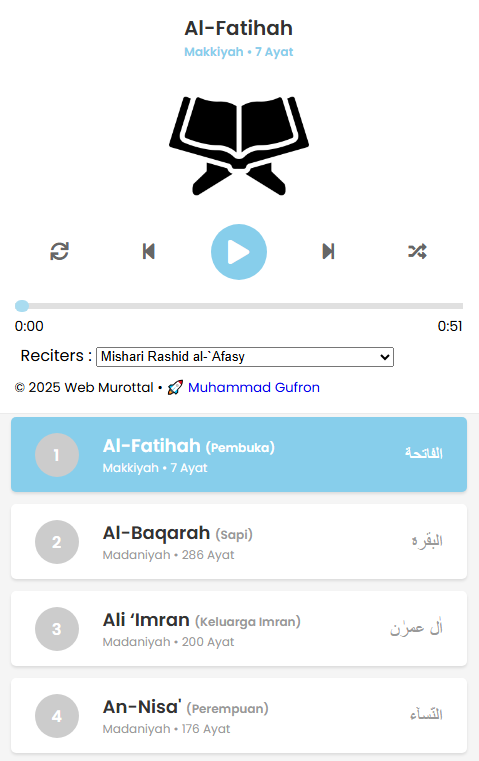

---

# 📖 Murottal Al-Qur'an Web

Website sederhana untuk mendengarkan murottal Al-Qur'an secara online dengan tampilan ringan, responsif, dan mudah digunakan.

🔗 **Live Preview**: [https://teman-hijrahmu.web.app/murottal](https://teman-hijrahmu.web.app/murottal)

---

## ✨ Fitur Utama

* 🎧 Streaming murottal Al-Qur'an
* 📱 Responsive (mobile & desktop friendly)
* ⚡ Ringan & cepat (static website)
* 📜 Navigasi surah yang mudah
* 🔁 Mode play (repeat & random)
* 🔊 Pilihan qari (imam)
* 🎯 Fokus ke pengalaman mendengarkan

---

## 🖼️ Preview Tampilan



---

## 🛠️ Teknologi yang Digunakan

* HTML5
* CSS3
* JavaScript (Vanilla)
* Firebase Hosting (untuk deploy)

---

## 📂 Struktur Project

```
Murottal-Al-Quran/
│
├── index.html
└── README.md
```

---

## 🚀 Cara Menjalankan Secara Lokal

1. Clone repository:

```bash
git clone https://github.com/Aghisna12/Murottal-Al-Quran.git
```

2. Masuk ke folder project:

```bash
cd Murottal-Al-Quran
```

3. Jalankan dengan Live Server / buka langsung:

```bash
index.html
```

---

## 🌐 Deploy ke Hosting

Project ini cocok untuk static hosting seperti:

* Firebase Hosting
* GitHub Pages
* Vercel
* Netlify

---

## 🤝 Kontribusi

Kontribusi sangat terbuka!

1. Fork repo ini
2. Buat branch baru:

```bash
git checkout -b fitur-baru
```

3. Commit perubahan:

```bash
git commit -m "Menambahkan fitur baru"
```

4. Push:

```bash
git push origin fitur-baru
```

5. Buat Pull Request 🚀

---

## 📄 Lisensi

Gunakan secara bebas untuk pembelajaran & pengembangan.
Silakan tambahkan lisensi sesuai kebutuhan.

---

## 🙏 Dukungan

Jika project ini bermanfaat:

⭐ Beri star di repository
🔁 Bagikan ke teman

---

## 🕌 Catatan

Semoga project ini bisa menjadi amal jariyah dan membantu banyak orang untuk lebih dekat dengan Al-Qur'an 🤲

---

## 👨‍💻 Author

**Aghisna**
GitHub: [https://github.com/Aghisna12](https://github.com/Aghisna12)

---
